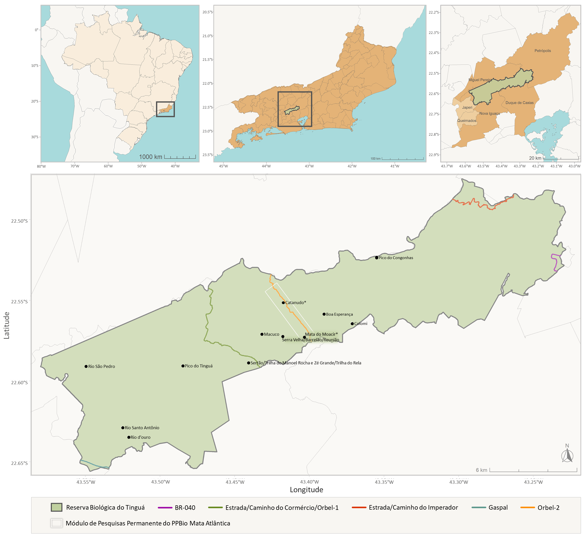

###

#### Contexto

A Reserva Biológica do Tinguá (REBIO do Tinguá), é uma Unidade de Conservação (UC) federal, localizada no Rio de Janeiro. Possui cerca de 26 mil hectares, representando a maior área reserva de Mata Atlântica do estado. Dentre as famílias botânicas ocorrentes na Mata Atlântica, Leguminosae tem destaque particularmente pela riqueza e abundância de suas espécies arbóreas. Este site foi desenvolvido com o objetivo de oferecer uma ferramenta pra identificação das Leguminosas que ocorrem na REBIO do Tinguá e contribuir com trabalhos de educação ambiental e com estudos ecológicos desenvolvidos na UC.

#### Recomendações

Para melhor funcionamento do site, abra-o no computador. Telas muito pequenas poderão ter erro de exibição de textos e de caracteres da chave.

Antes do uso da chave interativa leia as instruções indicadas no bloco de "Caracteres".

Em caso de problemas, duvidas, erros, caracteres erroneamente codificados, favor entrar em [contato](mailto:larasjdeccache@jbrj.gov.br).

#### Agradecimentos

Ao Prof. Marcelo Reginato (UFRGS) pelo desenvolvimento do [código](https://github.com/mreginato/Chave_familias_BR) e pelo [tutorial](https://github.com/mreginato/Chave_familias_BR/blob/master/tutorial/Adapting_the_key.md) disponibilizados para auxílio na elaboração da chave de identificação.

À Profa. Juliana Rando (UFOB) pelo [código](https://github.com/jugastaldello/Chave_FBO2020) disponibilizado utilizado nesta chave para melhor apresentação dos nomes das espécies.
